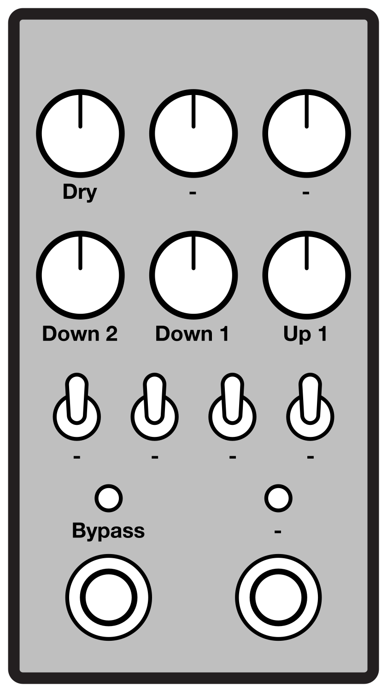

# Terrarium Poly Octave

This is firmware for a polyphonic octave shift effect pedal. It runs on an
[Electro-Smith Daisy Seed](https://www.electro-smith.com/daisy/daisy) mounted
in a [PedalPCB Terrarium](https://www.pedalpcb.com/product/pcb351/).

## Controls

### Knobs

#### Dry
Sets the output level of the dry signal.  Unity gain at center.

#### Down 2
Sets the output level of the signal shifted down by two octaves.  Unity gain at
center.

#### Down 1
Sets the output level of the signal shifted down by one octave.  Unity gain at
center.

#### Up 1
Sets the output level of the signal shifted up by one octave.  Unity gain at
center.

### Foot Switches and LEDs

#### Bypass
Enables and disables the pedal. The LED is lit when the pedal is active.

## Building

    cmake \
        -GNinja \
        -DTOOLCHAIN_PREFIX=/path/to/toolchain \
        -DCMAKE_TOOLCHAIN_FILE=lib/libDaisy/cmake/toolchains/stm32h750xx.cmake \
        -DCMAKE_BUILD_TYPE=Release \
        -B build .
    cmake --build build
