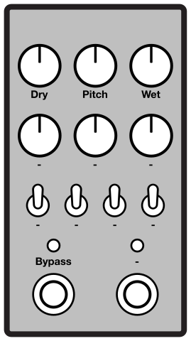

# Terrarium Poly Pitch

This is firmware for a polyphonic pitch shift effect pedal. It runs on an
[Electro-Smith Daisy Seed](https://www.electro-smith.com/daisy/daisy) mounted
in a [PedalPCB Terrarium](https://www.pedalpcb.com/product/pcb351/).

I've modified the algorithm used in my octave pedal to perform arbitrary pitch
shifts. It works, but the current hardware isn't fast enough to run it without
downsampling, which isn't acceptable for my purpose. I'm sharing the code in
case it's useful to somebody else.

## Controls

### Knobs

#### Dry
Sets the output level of the dry signal. Unity gain at center.

#### Pitch
Sets the amount to shift the pitch. Range is from one octave down to no shift.

#### Wet
Sets the output level of the shifted signal. Unity gain at center.

### Foot Switches and LEDs

#### Bypass
Enables and disables the pedal. The LED is lit when the pedal is active.

## Building

    cmake \
        -GNinja \
        -DTOOLCHAIN_PREFIX=/path/to/toolchain \
        -DCMAKE_TOOLCHAIN_FILE=lib/libDaisy/cmake/toolchains/stm32h750xx.cmake \
        -DCMAKE_BUILD_TYPE=Release \
        -B build .
    cmake --build build
